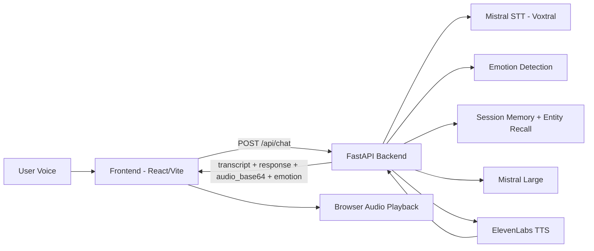
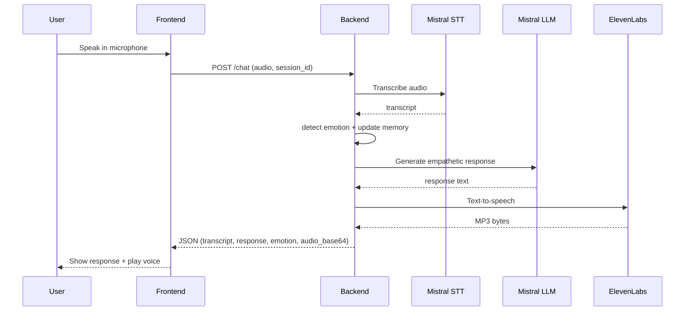

# SoulTalk AI 🧠💬

**Voice-first emotional AI companion** — Talk, and it listens with empathy.

Built for hackathon in 2 days. Prioritizes demo impact over production readiness.

---

## How It Works

1. **You speak** → Microphone captures audio
2. **Voxtral** → Speech-to-text transcription (Mistral STT endpoint with fallback)
3. **Mistral Large** → Generates emotionally intelligent response
4. **ElevenLabs** → Text-to-speech with natural voice
5. **You hear** → AI responds with warmth and empathy

---

## Tech Stack

| Layer     | Tech                        |
| --------- | --------------------------- |
| Frontend  | React (Vite) + TailwindCSS  |
| Backend   | Python FastAPI              |
| STT       | Voxtral (Mistral)           |
| LLM       | Mistral Large               |
| TTS       | ElevenLabs                  |
| Memory    | In-memory session memory + entity recall |

---

## Architecture

### System Architecture (High Level)



### Runtime Flow (Single Turn)



### Demo Visuals

- Add screenshots to `docs/images/` using the filenames below.


---

## Quick Start

### 1. Backend

```bash
cd backend
pip install -r requirements.txt

# Create either .env or .env.local with your API keys
# (.env.local takes priority)
cp .env.example .env.local
# Edit .env.local and add your keys:
#   MISTRAL_API_KEY=your_key
#   ELEVENLABS_API_KEY=your_key
#   ELEVENLABS_VOICE_ID=your_voice_id

python main.py
```

Backend runs on **http://localhost:8000**

### 2. Frontend

```bash
cd frontend
npm install
npm run dev
```

Frontend runs on **http://localhost:5173**

The frontend proxies API requests to the backend automatically.

---

## API Keys Required

| Service     | Get Key At                                    |
| ----------- | --------------------------------------------- |
| Mistral     | https://console.mistral.ai/                   |
| ElevenLabs  | https://elevenlabs.io/                        |

> **Note**: Use a **premade ElevenLabs voice ID** on free tier (for example `EXAVITQu4vr4xnSDxMaL`).

> **Demo mode**: If upstream APIs fail, the backend degrades gracefully so the UI flow still works.

---

## Security / Git Hygiene

- A root `.gitignore` is included.
- Credential files are ignored (`backend/.env`, `backend/.env.local`, other `.env.*`), while `backend/.env.example` is kept for sharing.

---

## Project Structure

```
├── backend/
│   ├── main.py              # FastAPI app (/session, /chat)
│   ├── config.py             # Environment config
│   ├── requirements.txt
│   ├── .env.example
│   └── services/
│       ├── voxtral_service.py    # Speech-to-text
│       ├── mistral_service.py    # LLM response generation
│       ├── emotion_service.py    # Emotion detection (sad/anxious/confused/neutral)
│       ├── elevenlabs_service.py # Text-to-speech
│       └── memory_service.py     # Session memory + entity extraction
├── frontend/
│   ├── src/
│   │   ├── main.tsx          # Entry point
│   │   ├── App.tsx           # Router
│   │   ├── api.ts            # Backend API client
│   │   ├── pages/
│   │   │   ├── Home.tsx      # Landing page
│   │   │   └── Chat.tsx      # Chat interface
│   │   ├── components/
│   │   │   ├── WaveAnimation.tsx
│   │   │   ├── MessageBubble.tsx
│   │   │   ├── EmotionBadge.tsx
│   │   │   └── ThinkingIndicator.tsx
│   │   └── hooks/
│   │       └── useAudioRecorder.ts
│   └── index.html
└── prompts/
    └── system_prompt.txt     # AI personality prompt
```

---

## Features

- 🎤 Voice input with real-time recording
- 🧠 Emotion-aware responses with validation-first style
- 💾 Memory recall for people, emotions, and situations
- ✨ Demo-ready recall behavior (including dad/stress flow)
- 🔊 ElevenLabs speech output with pause-aware phrasing
- 🌊 Audio wave + reflective thinking UX
- 🎨 Clean dark UI optimized for quick demos

---

## License

Hackathon project — use freely.
